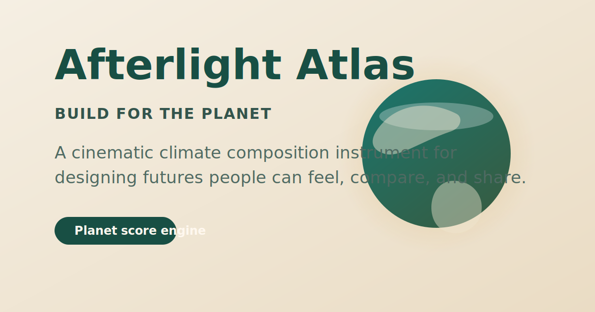

# Afterlight Atlas

<p align="center">
  
</p>

<p align="center">
  A cinematic climate composition instrument for designing futures people can feel, compare, and share.
</p>

<p align="center">
  <a href="https://github.com/ionfwsrijan/Afterlight-Atlas">Repository</a>
  ·
  <a href="./SUBMISSION.md">Challenge Submission</a>
</p>

## Overview

**Afterlight Atlas** is an Earth Day web experience built around one idea: climate interfaces do not have to feel like dashboards of guilt.

Instead of reducing the planet to a single calculator, the project invites people to compose speculative futures through systems thinking, editorial storytelling, and interactive worldbuilding. Users choose a world seed, tune seven planetary levers, and watch the interface respond through narrative, metrics, atmosphere, and comparison logic.

The result is a project that works as both an interactive product and a judge-friendly presentation tool.

## Why It Stands Out

- It frames sustainability as creative composition, not punishment.
- It turns infrastructure, ecology, and civic care into a world that feels lived in.
- It blends emotional storytelling with systems-level signals instead of choosing one or the other.
- It includes dedicated evaluation tools so judges can understand the project quickly.

## Feature Highlights

| Feature | What it does |
| --- | --- |
| Four world seeds | Starts each session from a distinct climate future with its own tone, palette, and systems bias. |
| Seven planetary levers | Lets users shape energy, mobility, food, water, materials, biodiversity, and care. |
| Planet score engine | Derives atmosphere, biodiversity, community, ocean, circularity, and heat signals from the active scenario. |
| Future dispatch | Converts system choices into story-rich narrative output instead of dry dashboard copy. |
| Three-horizon timeline | Projects each scenario forward through 2035, 2060, and 2085. |
| Snapshot archive | Saves alternate futures locally so users can revisit and compare them. |
| Judge Mode | Compares the active world against the seed baseline or a saved scenario and explains the delta clearly. |
| Present Mode | Simplifies the interface for cleaner walkthroughs and challenge judging. |
| Best Future preset | Instantly loads a tuned high-performing version of the current seed. |
| Comparison card export | Downloads a pitch-friendly PNG of the current Judge Mode comparison. |
| Shareable state | Encodes the active world in the URL hash for lightweight sharing. |

## Experience Flow

1. Pick a world seed such as `Mycelial City`, `Tidal Commons`, `Canopy Republic`, or `Solar Bazaar`.
2. Adjust the seven levers to shape the future.
3. Read the updated score, narrative dispatch, system signals, rituals, and horizon timeline.
4. Switch into Judge Mode to see what improved, what regressed, and why the scenario is stronger.
5. Save, present, export, or share the world.

## Built For The Earth Day Challenge

Afterlight Atlas was created for the DEV Community Earth Day challenge prompt, **Build for the Planet**.

It fits the theme in two ways:

- **Emotionally**: it centers hope, stewardship, repair, and imagination instead of doom-heavy framing.
- **Technically**: it models meaningful planetary systems like clean energy, mobility, water resilience, biodiversity recovery, circular materials, and civic care.

This is intentionally a **speculative storytelling tool**, not a scientific forecasting model. Its purpose is to make tradeoffs vivid, memorable, and discussable.

## Tech Stack

- TypeScript
- Vite
- Vanilla HTML rendering
- Custom CSS system for layout, motion, and editorial presentation
- Local Storage for saved scenarios
- Canvas export for comparison card generation

## Local Development

```bash
npm install
npm run dev
```

## Production Build

```bash
npm run build
npm run preview
```

The app is static-host friendly and can be deployed to Vercel, Netlify, or any platform that serves the `dist` directory.

## Project Structure

- `src/main.ts` handles rendering, interactions, Judge Mode, Present Mode, and export flows.
- `src/engine.ts` derives worlds, scores scenarios, builds comparisons, and manages serialization helpers.
- `src/data.ts` defines seeds, levers, and theme inputs.
- `src/types.ts` holds the shared data contracts.
- `src/style.css` contains the editorial UI system and responsive presentation layer.
- `public/` contains branding and social preview assets.

## Design Intent

Most climate projects explain what is wrong. Afterlight Atlas is designed to help people feel what a repaired future could be like.

That shift, from measurement alone to imagination plus evaluation, is the core of the project.
