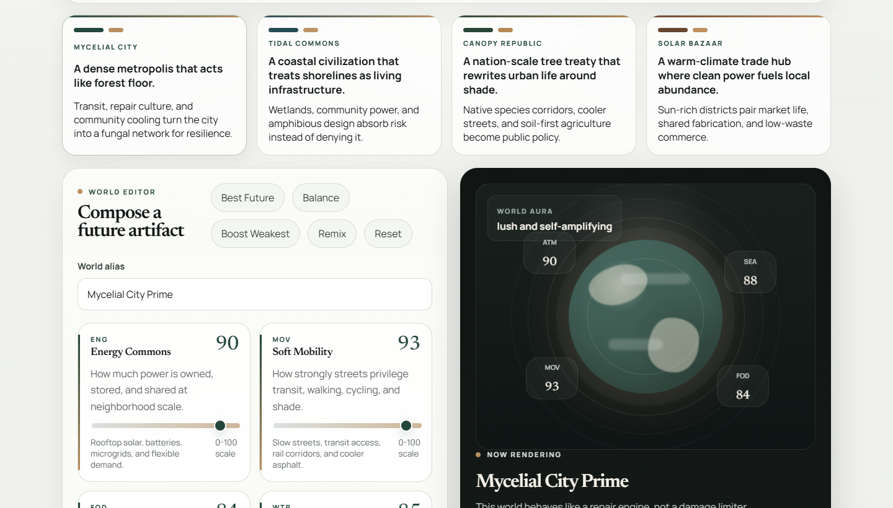

# Afterlight Atlas

Speculative climate worldbuilding for Earth Day. Shape future planetary scenarios, compare them in Judge Mode, and present them through a polished editorial interface.

[Live Demo](https://afterlight-atlas.vercel.app/) | [Challenge Submission](./SUBMISSION.md)

<p align="center">
  
</p>

## Overview

Afterlight Atlas is an Earth Day web experience built around a simple idea: climate interfaces do not have to feel like dashboards of guilt.

Instead of reducing the planet to a single calculator, the project lets people compose speculative futures through systems thinking, editorial storytelling, and interactive worldbuilding. Users choose a world seed, tune planetary levers, and watch the interface respond through narrative, metrics, atmosphere, and comparison logic.

The app is deliberately designed to work in two modes at once:

- as an exploratory product that invites people to imagine better futures
- as a presentation-friendly project that judges can understand quickly

That combination is what defines the project. It is not only a climate-themed interface. It is a storytelling instrument, a scenario composer, and a judging-friendly comparison tool in one package.

## Why This Project Exists

A lot of sustainability interfaces are useful, but they tend to feel emotionally narrow. They focus on warning, damage, guilt, or optimization. Those ideas matter, but they often leave very little room for imagination.

Afterlight Atlas takes a different approach.

It asks:

**What does a repaired future actually feel like?**

That shift changes the whole interaction model. Instead of telling people what they should fear, the project helps them compose futures that feel visible, lived in, and discussable. The goal is to make climate tradeoffs tangible without pretending to be a scientific simulator.

## What Makes It Different

- It treats sustainability as composition, not punishment.
- It turns infrastructure, ecology, and civic care into a world that feels lived in.
- It combines emotional storytelling with systems-level feedback.
- It gives users a future to shape instead of a number to regret.
- It includes dedicated judge-facing tools so the project explains itself quickly.
- It stays honest about what it is: a speculative climate storytelling tool, not a forecasting engine.

## Feature Breakdown

### World Seeds

The experience begins with four world seeds, each representing a distinct climate imagination:

- `Mycelial City`
- `Tidal Commons`
- `Canopy Republic`
- `Solar Bazaar`

Each seed comes with its own tone, visual palette, descriptive voice, and default systems profile. This gives the app stronger variety than a single generic sustainability canvas.

### Planetary Levers

Users shape a future through seven adjustable levers:

- energy
- mobility
- food
- water
- materials
- biodiversity
- care

These are intentionally systems-level levers rather than isolated habits. The interaction model emphasizes interdependence instead of one-off eco tips.

### Derived World Signals

Every scenario generates a live world state with:

- a planet score
- a world signature
- a visual aura
- strongest and weakest system levers
- dominant and vulnerable planetary signals
- narrative dispatch text
- repair rituals
- a three-horizon timeline

This makes the interface feel responsive in both analytical and emotional ways.

### Metric Layer

The project derives six speculative metrics from the active world:

- atmosphere
- biodiversity
- community
- ocean
- circularity
- heat

These metrics are not presented as scientific outputs. They are storytelling-oriented system signals that help users compare the shape of a future at a glance.

### Snapshot Archive

Users can save alternate futures locally and return to them later. This archive is important for comparison, iteration, and demo flow. It turns the app into a tool for exploring scenarios instead of a single linear interaction.

### Best Future Preset

The one-click `Best Future` action applies a tuned high-performing version of the active seed. This makes the project easier to demo, easier to judge, and faster to understand on first load.

### Export and Sharing

The project includes lightweight sharing and output features:

- URL hash serialization for shareable world state
- JSON download for world data
- copyable story output
- comparison card export as PNG

These features help the app function like a finished product rather than a static prototype.

## Experience Flow

The intended experience is straightforward and fast to understand:

1. Pick a world seed.
2. Rename the world with a custom alias if desired.
3. Adjust the seven levers to shape the scenario.
4. Read the updated score, signal set, dispatch, rituals, and timeline.
5. Save the scenario or compare it against a baseline.
6. Switch into Present Mode or export a comparison card for judging or sharing.

This structure matters because challenge judges usually move quickly. Afterlight Atlas is designed to reveal its purpose within the first interaction cycle.

## Judge Mode

Judge Mode is one of the most important pieces of the project.

It compares the current world against either:

- the original seed baseline
- a saved snapshot

From that comparison it surfaces:

- score delta
- strongest gain
- main watchout
- metric swings
- lever shifts
- a verdict
- a recommendation

This is a deliberate product decision. Many challenge entries look interesting but make judges work too hard to understand why they matter. Judge Mode solves that by making the app explain its own improvement logic.

## Present Mode

Present Mode simplifies the interface for a cleaner walkthrough. It reduces distractions and makes the experience easier to show during review, presentation, or screen recording.

Together, Judge Mode and Present Mode give the project a strong evaluation layer. That makes the repository feel more complete because the app is not only interactive, it is also demo-aware.

## Earth Day Fit

Afterlight Atlas was created for the DEV Community prompt, **Build for the Planet**.

It fits the challenge in two important ways.

### Emotional Fit

The project centers:

- hope
- stewardship
- repair
- imagination
- planetary care

That emotional frame matters because Earth Day work is not only about warning people. It is also about making a healthier relationship with the planet feel worth building.

### Technical Fit

Under the interface, the project is built around meaningful systems concerns:

- clean energy
- lower-emission mobility
- watershed resilience
- circular material flows
- biodiversity recovery
- civic resilience and care

So while the app is visually rich and editorial in tone, it is still organized around real categories of planetary decision-making.

## Design Direction

The interface is intentionally not styled like a generic startup dashboard.

The visual system aims for a quieter editorial feel:

- serif-led hero typography
- restrained earth-toned palette
- soft card geometry
- calm spacing
- premium contrast between light surfaces and the dark visualization panel
- minimal but meaningful motion

This direction helps the project feel more considered and less template-driven. It also supports the core idea that climate interfaces can be beautiful, thoughtful, and emotionally legible.

## Technical Architecture

Afterlight Atlas is intentionally lightweight.

It is built as a static front-end application with a small, direct architecture:

- `src/main.ts` renders the interface and wires interactions
- `src/engine.ts` derives worlds, scores scenarios, and compares baselines
- `src/data.ts` defines seeds, levers, and theme inputs
- `src/types.ts` defines the shared contracts used across the app
- `src/style.css` implements the full editorial presentation system

The project avoids framework overhead and keeps the logic close to the UI. That makes the app easy to host, easy to inspect, and fast to load.

## State and Data Model

The app keeps a compact local state model for:

- the active seed
- the current custom world alias
- the current lever values
- saved snapshots
- the active Judge Mode baseline
- present mode state
- transient notice banners

Saved worlds are stored locally, which keeps the experience self-contained and easy to run without backend infrastructure.

This also supports one of the project’s biggest practical strengths:

- no sign-in
- no API setup
- no server dependency
- no fragile integration layer

It behaves like a complete interactive artifact while staying deployment-friendly.

## Tech Stack

- TypeScript
- Vite
- Vanilla HTML rendering
- Custom CSS for layout, motion, and editorial presentation
- Local Storage for saved scenarios
- Canvas export for comparison card generation

## Run Locally

```bash
npm install
npm run dev
```

The local development server is powered by Vite and is enough to run the full project experience.

## Build and Deploy

To build the production bundle:

```bash
npm run build
```

To preview the production build locally:

```bash
npm run preview
```

The app is static-host friendly and deploys cleanly to platforms such as:

- Vercel
- Netlify
- GitHub Pages
- any host that can serve the `dist` directory

Live deployment:

- [afterlight-atlas.vercel.app](https://afterlight-atlas.vercel.app/)

## Project Structure

- `src/main.ts` handles rendering, interactions, input events, Judge Mode, Present Mode, sharing actions, and export flows.
- `src/engine.ts` derives world outputs, computes comparisons, manages saved snapshot helpers, and serializes or parses shareable URL state.
- `src/data.ts` defines the world seeds, lever metadata, and theme foundations that shape the personality of each scenario.
- `src/types.ts` holds the shared contracts for levers, metrics, saved snapshots, derived worlds, comparisons, and application state.
- `src/style.css` contains the responsive editorial UI system and the presentation layer that gives the app its identity.
- `public/` contains branding and preview assets used for the site and repository.
- `SUBMISSION.md` contains the full challenge submission write-up.

## Known Constraints

This project is intentionally framed with a few boundaries:

- It is not a climate science model.
- It does not predict real-world outcomes.
- Its scoring and world signals are speculative and interpretive.
- Saved worlds are local-first rather than cloud-synced.

These are deliberate tradeoffs. The goal is not scientific certainty. The goal is to make climate systems, futures, and tradeoffs easier to imagine, compare, and communicate.

## Closing Note

Most climate projects explain what is wrong. Afterlight Atlas is designed to help people feel what a repaired future could be like.

That shift, from measurement alone to imagination plus evaluation, is the core of the project.
